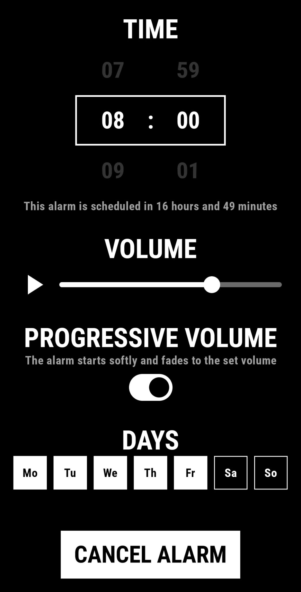
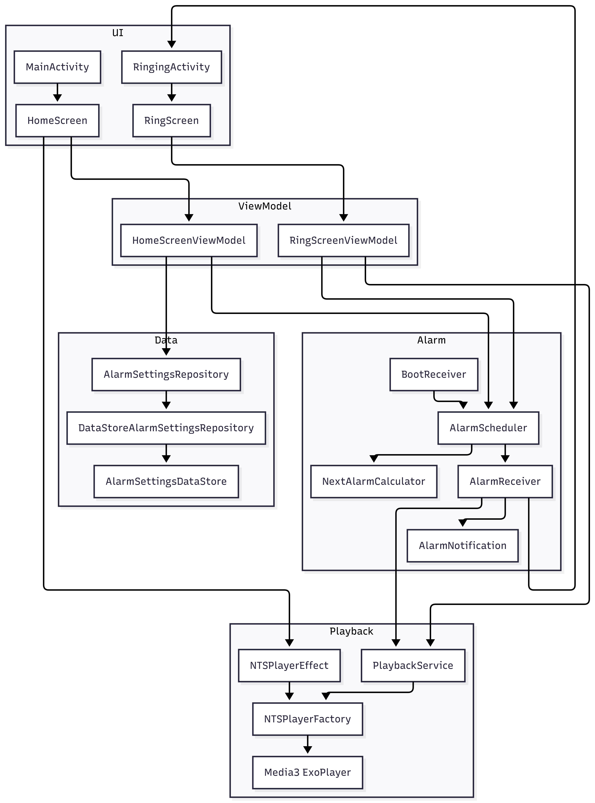

# NTS Alarm Clock

# (Work In Progress)

An Android alarm clock app that wakes you up using the live NTS Radio stream.

I love to wake up to NTS in the morning and couldn't find an app to do it, so I decided to develop
one!

Feel free to contribute and don't forget to [support our beloved NTS Radio](https://www.nts.live/supporters).

## Features

- Simple interface to set your alarm
- Adjust the maximum volume
- You can configure a progressive volume that increases over time
- Choose the days you want your alarm to repeat
- Fallback music plays if the stream is unavailable

## Warnings

1. I have to put the app as Work In Progress as users reported that the audio wasn't playing on some
   devices.
2. This app needs your permission to display notifications so the alarm can actually start. It will
   be asked when you start it.
3. This app also needs internet to play the stream, so put your phone in a silent mode when sleeping
   so the stream can run.
4. I tested this app on Android 9 and 16, but I advise you to run a classic alarm at the same time
   in case the app doesn't work, at least for the first time.

## Installation

This app isn't available on the Google Play Store.

Download the latest APK [here](https://github.com/alexandre-roux/NTSAlarmClock/releases/latest/download/NTSAlarmClock-latest.apk).

You can also scan this QR code from your phone:

Then open the file to install.

You may need to allow installation from unknown sources.

## Architecture & tech stack

The app follows a MVVM architecture. Here is a logical diagram:

A more detailed version of the diagram is
available [here](https://mermaid.ai/d/91e95f5c-8473-48df-b634-e855d02e446f).

Main building blocks:

- **Compose UI**: Declarative UI layer using a single-activity architecture.
- **ViewModels**: Handle UI state and orchestration using StateFlow and Coroutines.
- **Repository Pattern**: `AlarmSettingsRepository` provides a clean API for the UI to interact with
  data.
- **DataStore**: Used for persistent storage of alarm settings (time, enabled days, volume).
- **AlarmManager**: Schedules the alarms, integrated with a `BroadcastReceiver` to
  handle system events.
- **Foreground Service**: `PlaybackService` manages the lifecycle of the NTS stream to ensure it
  keeps playing.
- **Media3 (ExoPlayer)**: Used for streaming the live NTS Radio audio.

## Music credits

The fallback offline track used by this app is:

"Northern Glade" by Kevin MacLeod (incompetech.com)  
Licensed under Creative Commons Attribution 4.0 International (CC BY 4.0):  
http://creativecommons.org/licenses/by/4.0/
