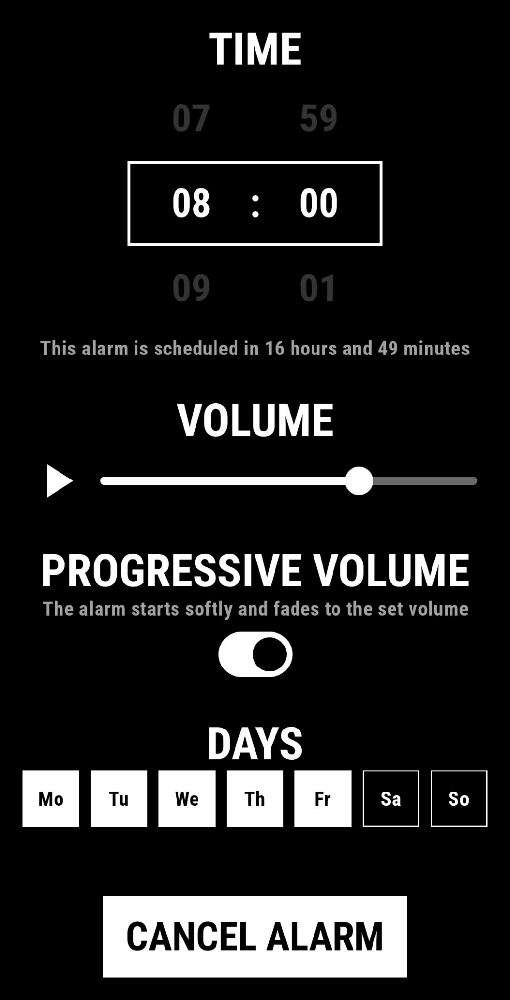
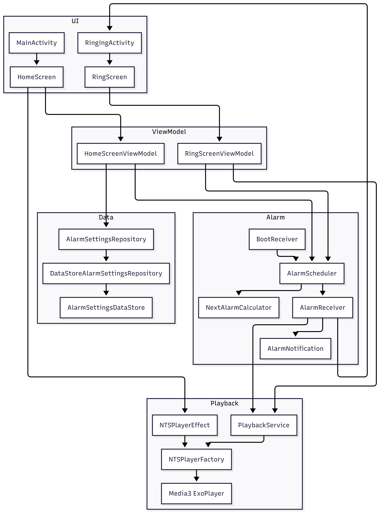

# NTS Alarm Clock

An Android alarm clock app that wakes you up using the live NTS Radio stream.

I love waking up to NTS in the morning and couldn’t find an app that did this, so I decided to build
one.

Feel free to contribute, and don’t forget
to [support our beloved NTS Radio](https://www.nts.live/supporters).

## Features

* Simple interface for configuring an alarm
* Adjustable maximum playback volume
* Progressive volume that gradually increases over time
* Customisable recurring days
* Offline fallback music if the live stream is unavailable

## Important information

1. The app requires notification and full-screen display permissions to start the alarm and show the
   ringing screen. The required permissions are requested during the onboarding process.
2. An internet connection is required to play the live NTS stream. If the stream cannot be played,
   the app automatically switches to a bundled offline track.
3. Alarm reliability can vary across Android versions and device manufacturers because of battery
   optimisation, exact-alarm, notification, and full-screen-intent restrictions. The app includes
   permission onboarding, boot rescheduling, and offline fallback audio to mitigate these
   limitations.
4. When using the app for the first time, it is recommended to test an alarm a few minutes in
   advance and verify that the required permissions have been granted.

## Installation

The app is not currently available on the Google Play Store.

Download the latest APK [here](https://github.com/alexandre-roux/NTSAlarmClock/releases/latest/download/NTSAlarmClock-latest.apk).

You can also scan this QR code with your phone:

Once downloaded, open the APK file to install the app.

Depending on your Android settings, you may need to allow your browser or file manager to install
apps from unknown sources.

## Architecture and tech stack

The app follows the MVVM architecture. The following diagram provides an overview of its main
components:

A more detailed version of the diagram is
available [here](https://mermaid.ai/d/91e95f5c-8473-48df-b634-e855d02e446f).

### Main building blocks

* **Jetpack Compose**: Declarative UI built using a single-activity architecture.
* **ViewModels**: Manage UI state and coordinate application logic using StateFlow and Kotlin
  Coroutines.
* **Repository pattern**: `AlarmSettingsRepository` provides a clean interface between the UI layer
  and persistent data.
* **DataStore**: Persists alarm settings, including the alarm time, enabled days, volume, and
  progressive-volume preference.
* **AlarmManager**: Schedules exact alarms and works with broadcast receivers to handle alarm and
  system events.
* **BroadcastReceiver**: Starts the alarm flow when an alarm is triggered and restores scheduled
  alarms after the device restarts.
* **Foreground service**: `PlaybackService` manages alarm playback independently of the UI
  lifecycle.
* **Media3 / ExoPlayer**: Plays the live NTS Radio stream and the bundled offline fallback track.
* **Retrofit**: Retrieves information about the currently playing NTS show.
* **Hilt**: Manages dependency creation and injection across the application.

## Reliability and fallback behaviour

When an alarm is triggered, the app starts a foreground playback service and attempts to play the
live NTS Radio stream.

If the stream cannot be loaded because of a network or playback error, the app automatically
switches to a bundled offline track. Progressive volume and the configured maximum volume are
applied to both playback sources.

Recurring alarms are recalculated after they ring, and scheduled alarms are restored when the device
restarts.

## Testing

The project includes unit and instrumentation tests covering key behaviours such as:

* Calculating the next alarm occurrence
* Scheduling and cancelling alarms
* Restoring alarms after a device restart
* Persisting alarm settings
* ViewModel state management
* Progressive-volume calculations
* Playback fallback behaviour
* Notification and manifest configuration
* Main Compose screens

## Music credits

The fallback offline track used by this app is:

**“Northern Glade” by Kevin MacLeod**
Source: incompetech.com
Licensed under
the [Creative Commons Attribution 4.0 International licence](https://creativecommons.org/licenses/by/4.0/).
